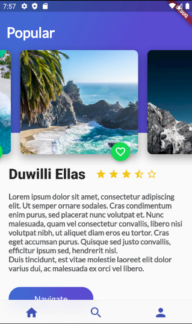
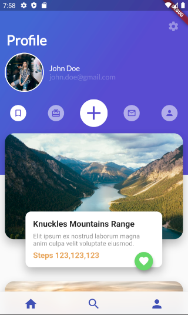
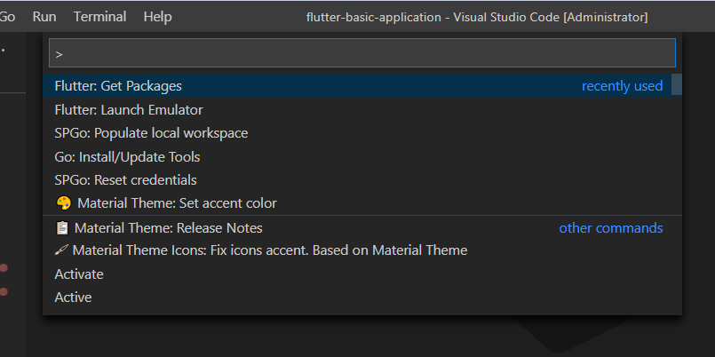
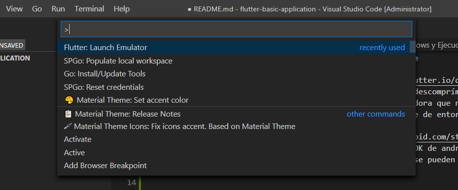
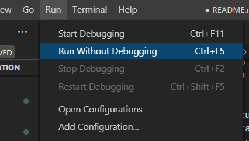
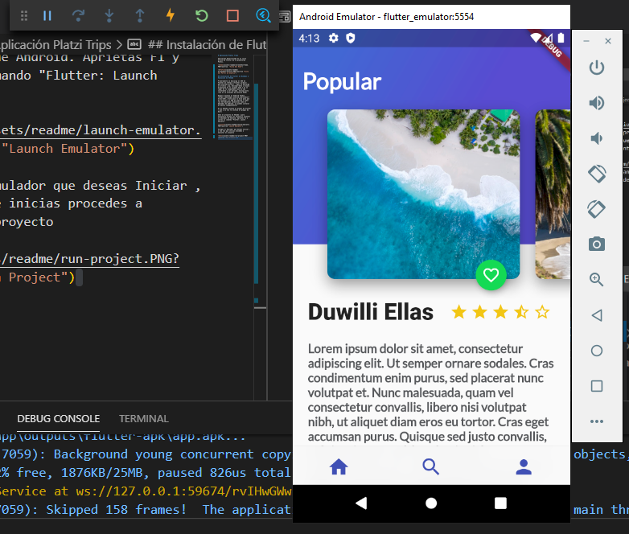

# Aplicación Platzi Trips

Aplicación desarrollada en el curso básico de Flutter de la plataforma Platzi.

## Instalación de Flutter en Windows y Ejecución del proyecto con VSCode

Descarga el SDK de Flutter en <https://flutter.io/docs/get-started/install>. Es un fichero .zip, descomprímelo y ponlo en la ruta que desees. Incluye esta ruta en la variable de entorno PATH

Instala el Android Studio <https://developer.android.com/studio/?hl=es-419>.(Este paso no es necesario, pero así se instalará el SDK de android y todas las herramientas necesarias como el Emulador, pero se pueden instalar de manera independiente)

En el VSCode instala el plugin de Flutter(que a su vez te instala el plugin de Dart)

Abre el proyecto en VSCode y para ejecutarlo primero es necesario instalar las dependencias. Para eso aprietas F1 y ejecutas "Flutter: Get Packages"

Después es necesario levantar un emulador de Android donde correr el proyecto. Aprietas F1 y corres el comando "Flutter: Launch Emulator"

Escoges el Emulador que deseas Iniciar, y una vez que inicie procedes a ejecutar el proyecto con Ctrl+F5

Después de un tiempo te debe mostrar el proyecto corriendo en el emulador

